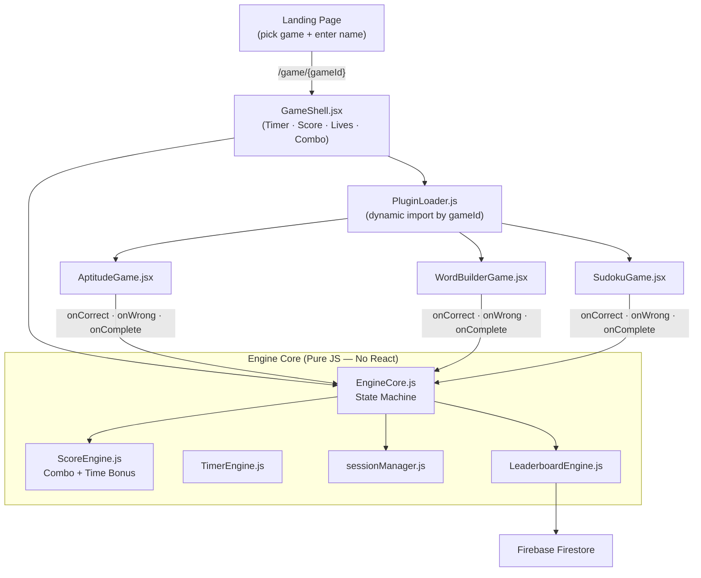

# SkillArena — TaPTaP Game Engine

> **TaPTaP Game Engine Hackathon 2026 — League 1: Engine League**
> Theme: *Gamify Learning. Amplify Employability.*

SkillArena is a **plugin-based game engine** built on Next.js 16 + Firebase. It loads any game from a JSON config, renders it inside a universal game shell, and handles timer, scoring, combo system, and leaderboard identically across all games. Think of it like a **game console** — the console stays the same, the cartridge (JSON + plugin) changes.

**Ships with 3 mandatory games:** SudokuBlitz · WordBuilder · AptitudeBlitz

---

## Quick Setup (5 steps)

```bash
# 1. Clone and install
git clone <repo-url>
cd skillarena
npm install

# 2. Set up Firebase credentials
# Create a project at console.firebase.google.com
# Enable: Firestore, Anonymous Auth, Storage
# Then fill in .env.local:
cp .env.local.example .env.local   # or just edit .env.local directly

# 3. Run dev server
npm run dev
# → http://localhost:3000

# 4. (Optional) Build for production
npm run build

# 5. Deploy
npx vercel   # add NEXT_PUBLIC_FIREBASE_* vars in Vercel dashboard
```

### `.env.local` variables required

```
NEXT_PUBLIC_FIREBASE_API_KEY=
NEXT_PUBLIC_FIREBASE_AUTH_DOMAIN=
NEXT_PUBLIC_FIREBASE_PROJECT_ID=
NEXT_PUBLIC_FIREBASE_STORAGE_BUCKET=
NEXT_PUBLIC_FIREBASE_MESSAGING_SENDER_ID=
NEXT_PUBLIC_FIREBASE_APP_ID=
```

---

## Tech Stack

| Layer | Technology |
|---|---|
| Framework | Next.js 16 (App Router) |
| Language | JavaScript (JSX) |
| Styling | Tailwind CSS |
| Animations | Framer Motion |
| Database | Firebase Firestore (real-time leaderboard) |
| Auth | Firebase Anonymous Auth |
| Hosting | Vercel |

---

## Architecture — How the Plugin System Works

This is the core concept. The engine **never knows what game it's running**. 

### ⚠️ Important: Configs vs New Game Mechanics
There are two ways to extend SkillArena:
1. **Adding new configs (No code required):** Anyone can upload a JSON config to create unlimited variations of *existing* games (e.g., a new 9x9 Sudoku layout, a new word set, or a new 20-question Aptitude test). This is done entirely via JSON.
2. **Adding new mechanics (Code required):** If you want a fundamentally new game mechanic (like a platformer, snake, or memory match), a developer must write the React Plugin (e.g., `MemoryMatchGame.jsx`) and register its `gameId` in `PluginLoader.js` *once*. After that, anyone can upload JSONs for the new game mechanic.

### Flowchart


### Request Lifecycle
```
User picks "Sudoku" on landing page
         ↓
/game/sudoku → fetch /games/sudoku.json (config loaded)
         ↓
useEngineCore hook → PluginLoader.js dynamically imports SudokuGame.jsx
         ↓
3-second countdown overlay
         ↓
GameShell renders: [Timer] [Score] [Lives] [Combo] [← SudokuGame renders here →]
         ↓
SudokuGame fires callbacks as player interacts:
  onCorrect(points)  ← engine applies combo multiplier, updates score
  onWrong()          ← engine removes life, resets combo
  onComplete()       ← engine finalizes session, navigates to results
         ↓
LeaderboardEngine submits score to Firestore
         ↓
/results page shows score + live leaderboard
```

### Engine State Machine

Managed by `engine/EngineCore.js` (pure JS, no React):

```
IDLE → LOADING → COUNTDOWN(3s) → PLAYING → GAME_OVER → RESULTS
                                     ↕
                           (plugin callbacks fire here)
```

- **IDLE** → initial state before init
- **LOADING** → dynamically importing the plugin module
- **COUNTDOWN** → 3-2-1 overlay before game starts
- **PLAYING** → plugin is active, engine processes callbacks
- **GAME_OVER** → lives = 0 or timer expired
- **RESULTS** → plugin called onComplete(); score submitted

### Plugin Interface Contract

Every game plugin receives exactly these props from GameShell. That's the entire contract.

```js
{
  config: object,          // the full config.json data (meta + config sections)
  onCorrect: (pts) => void, // call when player gets something right (pass raw points — engine applies combo on top)
  onWrong: () => void,      // call when player gets something wrong (engine removes 1 life, resets combo)
  onComplete: () => void,   // call when game/round is finished
  isActive: boolean,        // false when game is over — plugin should freeze its UI
}
```

The plugin computes its own base points + time bonus and passes them to `onCorrect(pts)`. The engine applies the **combo multiplier** on top. This way the plugin owns its timing logic and the engine owns the global scoring math.

---

## Full Project Structure

```
skillarena/
│
├── app/
│   ├── page.jsx                          ← Landing: pick a game + enter name → /game/{gameId}
│   ├── layout.tsx                        ← Root layout (includes global Navbar + Auth Provider)
│   ├── leaderboards/page.jsx             ← Global leaderboard browser
│   ├── game/[roomId]/page.jsx            ← Engine shell (params.roomId = gameId)
│   ├── results/page.jsx                  ← Score summary + live leaderboard
│   ├── admin/page.jsx                    ← Upload new game JSON configs to Firestore
│   └── api/
│       ├── submit-score/route.js         ← POST: write score to /leaderboard/{gameId}/scores
│       ├── generate-room/route.js        ← POST: generate secure session/room ID
│       └── validate/route.js             ← POST: server-side answer validation (legacy)
│
├── engine/                               ← CORE ENGINE — pure JS, no React, fully testable
│   ├── EngineCore.js                     ← State machine + pure handlers (handleCorrect/Wrong/Complete)
│   ├── PluginLoader.js                   ← PLUGIN_REGISTRY: dynamic import by gameId
│   ├── ScoreEngine.js                    ← calcTimeBonus, getComboMultiplier, applyCorrect, applyWrong
│   ├── TimerEngine.js                    ← Pure timer state functions (no React)
│   ├── LeaderboardEngine.js              ← submitFinalScore, fetchTopScores (wraps firestoreHelpers)
│   └── sessionManager.js                ← createSession, finalizeSession (player state shape)
│
├── plugins/                              ← GAME PLUGINS — one folder per game
│   ├── aptitude-blitz/
│   │   ├── AptitudeGame.jsx              ← MCQ UI: question + 4 options + per-question timer
│   │   ├── aptitudeLogic.js             ← isCorrect(), calcPoints() (base + time bonus)
│   │   └── config.json                  ← 10 aptitude questions (meta + config.questions[])
│   ├── word-builder/
│   │   ├── WordBuilderGame.jsx           ← Letter tile UI: tap tiles → build word → submit
│   │   ├── wordLogic.js                 ← canFormWord(), validateWord(), calcWordPoints()
│   │   └── config.json                  ← 3 rounds with letter sets (meta + config.rounds[])
│   └── sudoku/
│       ├── SudokuGame.jsx                ← 9×9 grid UI + number pad (mobile-friendly)
│       ├── sudokuLogic.js               ← isCorrectPlacement(), isSolved(), countEmpty()
│       └── config.json                  ← Puzzle grid + solution (meta + config.puzzles[])
│
├── components/                           ← Shared UI — same across all games
│   ├── Navbar.jsx                        ← Global auto-hiding navigation bar
│   ├── FirebaseAuthProvider.jsx          ← Anonymous auth wrapper for Firestore rules
│   ├── GameShell.jsx                     ← Universal wrapper: [Header: timer+score+lives+combo] + [plugin slot]
│   ├── Timer.jsx                         ← Countdown bar (green → red when urgent, pulsing at <5s)
│   ├── LifeBar.jsx                       ← Heart icons (animated pop-out on life loss)
│   ├── ComboIndicator.jsx                ← Combo badge (shows only at streak ≥ 3)
│   ├── ScorePopup.jsx                    ← Floating "+pts" animation on correct answer
│   ├── Leaderboard.jsx                   ← Real-time score table (Firestore onSnapshot)
│   ├── QuestionCard.jsx                  ← (legacy quiz component)
│   └── AnalyticsChart.jsx               ← (legacy analytics component)
│
├── hooks/
│   ├── useEngineCore.js                  ← Main game hook: loads plugin → countdown → manages engine state
│   ├── useTimer.js                       ← Countdown timer hook (supports resetKey for per-question reset)
│   └── useLeaderboard.js                ← Real-time Firestore subscription → sorted scores[]
│
├── lib/
│   ├── firebase.js                       ← Lazy Firebase init (getDb(), getAuthInstance()) — works without .env.local at build time
│   └── firestoreHelpers.js              ← All Firestore read/write (submitScore, subscribeToGameLeaderboard, etc.)
│
├── constants/
│   └── gameConfig.js                    ← All tunable constants (combo thresholds, time bonuses, etc.)
│
├── public/
│   └── games/                           ← Static JSON configs — fetched at runtime by the engine shell
│       ├── aptitude-blitz.json
│       ├── word-builder.json
│       └── sudoku.json
│
└── .env.local                           ← Firebase credentials (never commit)
```

---

## Engine Deep Dive

### ScoreEngine.js — Scoring Rules

```
Points earned = round(rawPoints × comboMultiplier)

rawPoints = basePoints + timeBonus
  basePoints   → defined per question/cell in config
  timeBonus    → +5 pts if answered in ≤5s | +2 pts if ≤10s | +0 pts otherwise

comboMultiplier → based on consecutive correct streak:
  streak 0-2   → 1.0x
  streak 3-4   → 1.5x
  streak 5-9   → 2.0x
  streak 10+   → 3.0x

Wrong answer:
  → lives -= 1
  → streak resets to 0
  → multiplier resets to 1.0x

Game Over: lives <= 0 OR main timer hits 0
```

### PluginLoader.js — Adding New Games

The entire plugin registry is ONE object:

```js
// engine/PluginLoader.js
const PLUGIN_REGISTRY = {
  "aptitude-blitz": () => import("../plugins/aptitude-blitz/AptitudeGame"),
  "word-builder":   () => import("../plugins/word-builder/WordBuilderGame"),
  "sudoku":         () => import("../plugins/sudoku/SudokuGame"),
  // Add your game here ↑
};
```

### useEngineCore.js — How the Hook Works

```
1. Receives (playerName, gameConfig)
2. Sets engine state → LOADING
3. Calls loadPlugin(gameId) → dynamic import → gets Plugin component
4. Runs 3s countdown (setInterval)
5. Sets engine state → PLAYING → plugin renders
6. Exposes: onCorrect, onWrong, onComplete, onTimerExpire
7. On GAME_OVER or RESULTS → auto-submits score via LeaderboardEngine
```

### Firebase — Lazy Initialization

`lib/firebase.js` uses **lazy getters** so the build works without `.env.local`:

```js
// Safe at build time — only initializes when actually called at runtime
export function getDb() { return db ?? (db = getFirestore(app)); }
```

---

## Firestore Data Structure

```
/leaderboard/{gameId}/scores/{scoreId}
  playerName: string
  score:      number
  timeTaken:  number       ← tie-breaker: lower = better rank
  gameId:     string
  difficulty: string
  createdAt:  timestamp

/gameConfigs/{gameId}      ← uploaded via /admin
  meta:   object
  config: object
  uploadedAt: timestamp
```

---

## JSON Config Format (for all games)

### Universal meta block (required for every game)

```json
{
  "meta": {
    "gameId":      "your-game-id",
    "gameType":    "mcq",
    "title":       "Game Title",
    "description": "Short description",
    "difficulty":  "medium",
    "timeLimit":   120,
    "lives":       3,
    "version":     "1.0"
  },
  "config": {}
}
```

`gameType` options: `"grid"` | `"word"` | `"mcq"` | `"logic"`

### AptitudeBlitz — MCQ config

```json
{
  "meta": { "gameId": "aptitude-blitz", "gameType": "mcq", "timeLimit": 150, "timePerQuestion": 15, "lives": 3 },
  "config": {
    "questions": [
      {
        "id": "q1",
        "question": "If 20% of a number is 80, what is the number?",
        "options": ["300", "400", "500", "600"],
        "answer": "400",
        "topic": "Percentages",
        "points": 10,
        "explanation": "20% of x = 80 → x = 400"
      }
    ]
  }
}
```

### WordBuilder — Word formation config

```json
{
  "meta": { "gameId": "word-builder", "gameType": "word", "timeLimit": 90, "lives": 3 },
  "config": {
    "rounds": [
      {
        "id": "r1",
        "letters": ["P", "L", "A", "N", "E", "T", "S", "O", "R", "A", "T"],
        "minWordLength": 3,
        "pointsPerLetter": 5,
        "bonusWords": ["PLANET", "PATROL"],
        "bonusMultiplier": 2
      }
    ]
  }
}
```

### SudokuBlitz — Grid config

```json
{
  "meta": { "gameId": "sudoku", "gameType": "grid", "timeLimit": 300, "lives": 3 },
  "config": {
    "puzzles": [
      {
        "id": "p1",
        "difficulty": "easy",
        "pointsPerCell": 5,
        "grid": [
          [5,3,0,0,7,0,0,0,0],
          ...
        ],
        "solution": [
          [5,3,4,6,7,8,9,1,2],
          ...
        ]
      }
    ]
  }
}
```

---

## How to Add a New Game (30 minutes or less)

This is the proof of the plugin system's reusability. Judges can verify this.

### Step 1 — Create the plugin folder

```bash
mkdir plugins/logic-gates
```

### Step 2 — Create `config.json`

```json
{
  "meta": {
    "gameId": "logic-gates",
    "gameType": "logic",
    "title": "Logic Gates",
    "description": "Solve boolean logic puzzles.",
    "difficulty": "hard",
    "timeLimit": 180,
    "lives": 3,
    "version": "1.0"
  },
  "config": {
    "puzzles": [...]
  }
}
```

Copy it to `public/games/logic-gates.json` so the engine can fetch it at runtime.

### Step 3 — Create `logicGateLogic.js`

Pure functions. No React. Game rules only.

```js
export function isCorrect(puzzle, answer) { ... }
export function calcPoints(puzzle, secondsTaken) { ... }
```

### Step 4 — Create `LogicGateGame.jsx`

Implement the plugin interface — these 5 props are ALL the engine gives you:

```jsx
export default function LogicGateGame({ config, onCorrect, onWrong, onComplete, isActive }) {
  // Your game UI here
  // Call onCorrect(points) when player is right
  // Call onWrong() when player is wrong
  // Call onComplete() when all puzzles are done
  // Freeze UI when isActive === false
}
```

### Step 5 — Register in PluginLoader.js

```js
// engine/PluginLoader.js — add ONE line:
"logic-gates": () => import("../plugins/logic-gates/LogicGateGame"),
```

### That's it.

Timer, scoring, combo multiplier, lives, leaderboard, results page — all work automatically. No engine changes.

---

## Game-Specific Notes

### AptitudeBlitz
- 10 MCQ questions, 15 seconds per question
- Plugin manages its own per-question timer (resets on each question via `resetKey`)
- Main engine timer = 150s (15 × 10 questions)
- On timeout: `onWrong()` fires, question advances after 1.5s reveal
- Points = base (10) + time bonus (up to +5) → engine multiplies by combo

### WordBuilder
- 3 rounds of letter tiles
- Player taps tiles to build words, submits to validate
- Validation: word must be formable from the tile pool (multiset check) + min 3 letters
- No life loss on invalid attempt — error flash shown, combo intact
- Bonus words (defined in config) score 2× points
- Game ends when main engine timer expires (`isActive` → false → `onComplete()`)

### SudokuBlitz
- Single 9×9 puzzle, 5-minute timer
- Pre-filled cells (non-zero in grid) are not editable
- Correct cell fill: `onCorrect(5pts)` + checks if puzzle is solved
- Wrong cell fill: `onWrong()` + cell turns red and clears after 800ms
- Number pad shown on mobile; keyboard (1-9, Backspace) on desktop
- `onComplete()` fires when all 51 empty cells are correctly filled

---

## Scoring Constants (`constants/gameConfig.js`)

```js
COMBO_THRESHOLDS:      { 3: 1.5, 5: 2.0, 10: 3.0 }
TIME_BONUS_TIERS:      { 5: 5, 10: 2 }        // seconds: bonus points
DEFAULT_LIVES:         3
DEFAULT_TIME_LIMIT:    120                     // seconds
ANSWER_REVEAL_DURATION: 1500                   // ms before advancing
COUNTDOWN_BEFORE_START: 3                      // seconds
MIN_WORD_LENGTH:       3
```

---

## UI Design System

| Token | Value |
|---|---|
| Background | `#0f0f1a` |
| Correct / Green | `#00ff88` |
| Wrong / Pink | `#ff0099` |
| Accent / Purple | `#b44fff` |
| Muted text | `#8888aa` |
| Border | `#2a2a4a` |
| Font | Space Grotesk (Google Fonts) |

Animations: Framer Motion throughout — transitions, combo pop, score increment, score popup.

---

## API Routes

### `POST /api/submit-score`
```json
// Request body
{ "playerName": "Vedant", "gameId": "sudoku", "score": 255, "timeTaken": 142, "difficulty": "easy" }

// Response
{ "scoreId": "1708698000000_abc123" }
```

### `POST /api/generate-room`
```json
// Response
{ "roomId": "XK9P2M" }
```

---

## Files a Claude Instance Needs to Understand First

If you're picking this up to continue development, read these files in order:

1. **`CLAUDE.md`** — full spec and build order
2. **`engine/EngineCore.js`** — state machine (20 lines of pure functions)
3. **`engine/PluginLoader.js`** — plugin registry (10 lines)
4. **`hooks/useEngineCore.js`** — React wrapper (the main game hook)
5. **`components/GameShell.jsx`** — universal game wrapper UI
6. **`plugins/aptitude-blitz/AptitudeGame.jsx`** — simplest plugin, best reference
7. **`app/game/[roomId]/page.jsx`** — engine shell page (`params.roomId` = `gameId`)
8. **`lib/firestoreHelpers.js`** — all Firestore ops

---

## Known Issues / TODO

- [ ] **WordBuilder**: No dictionary validation yet — accepts any string formable from tiles. Need to integrate Free Dictionary API (`https://api.dictionaryapi.dev/api/v2/entries/en/{word}`) or bundle a word list.
- [ ] **PvP / Room mode**: Current architecture is single-player + shared leaderboard. Real-time PvP rooms (multiple players in the same session) not yet implemented.
- [ ] **SudokuBlitz**: Only 1 puzzle in config. Need more puzzles / difficulty levels.
- [ ] **Admin upload**: Config uploaded to Firestore but engine currently fetches from `public/games/` static files. Need to add Firestore config fetch fallback.

---

## Team

| | |
|---|---|
| Name | Vedmohan |
| Email | vedmohan0@gmail.com |
| Hackathon | TaPTaP Game Engine Hackathon 2026 — League 1 |
| Submission deadline | March 31, 2026 |

---

*Built for TaPTaP Game Engine Hackathon 2026 | games@theblackbucks.com*
